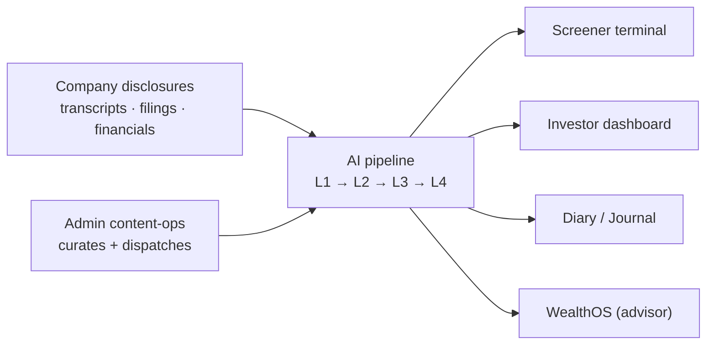

# QuantCase Frontend


AI-powered investment-research terminal for Indian equities. QuantCase turns company disclosures
(earnings-call transcripts, filings) into structured, scored research across analysis pillars —
management quality, opportunity, deal/valuation — and delivers it through a stock screener, investor
dashboards, a journal, and an advisor (WealthOS) workspace.

Built with **Next.js 16** (App Router), **React 19**, **TypeScript**, **Tailwind CSS v4**, and
**shadcn/ui**. It talks to a separate QuantCase backend over a simple REST API.



## Quick start

```bash
npm install
npm run dev      # → http://localhost:3000
```

In local dev the app expects a backend on **`http://localhost:8000`** for data-driven pages (the URL
is environment-switched in [`src/lib/constants.ts`](src/lib/constants.ts)). No `.env` file is
required — see [Getting started](docs/getting-started.md) for details.

| Script | Purpose |
|--------|---------|
| `npm run dev` | Dev server (HMR) |
| `npm run build` | Production build |
| `npm run start` | Serve a production build |
| `npm run lint` | ESLint |

## Documentation

Full documentation lives in [`docs/`](docs/README.md) — start with the [documentation hub](docs/README.md)
for the visual map. Highlights:

- **Foundations** — [Getting started](docs/getting-started.md) · [Architecture](docs/architecture.md) · [Routing & auth](docs/routing-and-auth.md)
- **Data & AI pipeline** — [Data fetching](docs/data-fetching.md) · [Pipeline & analysis layers](docs/pipeline-layers.md) 🔑 · [Async jobs](docs/async-jobs.md)
- **Feature modules** — [Screener](docs/screener.md) · [Investor](docs/investor.md) · [Diary & Journal](docs/diary-journal.md) · [WealthOS](docs/wealthos.md) · [Model builder](docs/model-builder.md) · [Platform flows](docs/platform-flows.md)
- **Admin & ops** — [Admin & content-ops](docs/admin.md)
- **Design** — [Components](docs/components.md) · [Design system](docs/design-system.md)

For contributor/agent conventions and the design-system contract, see
[`CLAUDE.md`](CLAUDE.md). Archived design mockups and backend/product specs live in
[`extras/`](extras/README.md) (not part of the live frontend).

## Project layout

```
src/
  app/          App Router routes (route groups: (app), (onboarding))
  components/   ui/ · ds/ · molecules/ · feature dirs
  hooks/        data-fetching + job-polling hooks
  lib/          api.ts, constants.ts, adapters, utils
  types/        TypeScript types (models/ holds a small older set)
docs/           this documentation
extras/         archived mockups, specs, notes
```
