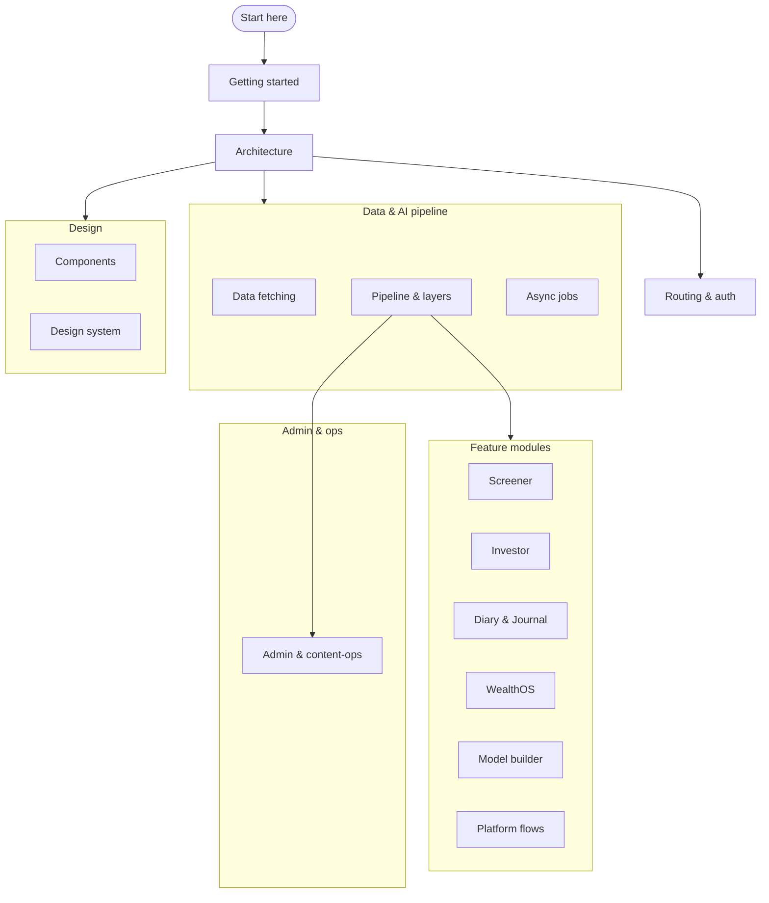

# QuantCase Frontend — Documentation

QuantCase is an AI-powered investment-research terminal for Indian equities. It turns raw company
disclosures (earnings-call transcripts, filings) into structured, scored research across a set of
analysis **pillars** — management quality, opportunity, deal/valuation — and surfaces them through a
screener, investor dashboards, a journal, and an advisor (WealthOS) workspace.

This is the **frontend** — a Next.js 16 (App Router) + React 19 + TypeScript app that talks to a
separate QuantCase backend over a simple REST API.

---

## Documentation map

> [!TIP]
> New to the codebase? Read in order: **Getting started → Architecture → Pipeline & layers**. The pipeline
> doc is the mental model everything else builds on.

---

## Index

### Foundations

| Doc | What's inside |
|-----|---------------|
| [Getting started](getting-started.md) | Prerequisites, install, dev/build/lint scripts, config files, and the local-backend expectation. **Start here.** |
| [Architecture](architecture.md) | Tech stack, App Router layout, route groups, the full route map, provider stack, and conventions. |
| [Routing & auth](routing-and-auth.md) | `AuthGuard`, account types and access flows, admin gating, and the URL-param state convention. |

### Data & AI pipeline

| Doc | What's inside |
|-----|---------------|
| [Data fetching](data-fetching.md) | The `api.ts` callback pattern, the `{ success, data }` envelope, the hook convention, and adapters. |
| [Pipeline & analysis layers](pipeline-layers.md) | 🔑 The `L1 → L2 → L3 → L4` analysis pipeline and the KPI data model — the core mental model. |
| [Async job pipeline](async-jobs.md) | How AI analysis jobs are triggered and polled (the BullMQ flow) and how progress is animated. |

### Feature modules

| Doc | What's inside |
|-----|---------------|
| [Screener](screener.md) | The asset terminal — every `?symbol=` sub-page (overview, fundamentals, technicals, wyckoff, industry, MF, baskets) + the shared insight engine. |
| [Investor](investor.md) | The investor dashboard, first-party + smallcase-linked portfolios, and the MOD synopsis. |
| [Diary & Journal](diary-journal.md) | The investment journal — journals, note/thesis entries, conviction, AI thesis-health. |
| [WealthOS](wealthos.md) | The advisor CRM — RM dashboard, clients, models, interactions, suggestions, analytics. |
| [Model builder & analytics](model-builder.md) | The portfolio-construction stepper and the model store. |
| [Platform flows](platform-flows.md) | Onboarding, billing/paywall/Razorpay, auth screens, landing, and private-equity/DRHP. |

### Admin & ops

| Doc | What's inside |
|-----|---------------|
| [Admin & content-ops](admin.md) | The operator console — skills/plugins, the KPI system, and coverage/ingestion (Prowess, BSE, PDF). |

### Design

| Doc | What's inside |
|-----|---------------|
| [Components](components.md) | The atomic-design layers (`ui/` → `ds/` → `molecules/` → feature dirs) and where to build new UI. |
| [Design system](design-system.md) | The authoritative `--qc-*` token language, themes, typography, and primitive patterns. |

### Page specs

Widget-level specifications for individual pages:

- [Management dashboard](page-management.md) — the `/screener/management` factor page.
- [AI transcript](page-ai-transcript.md) — the AI transcript analysis flow.

---

## Related

- [`../CLAUDE.md`](../CLAUDE.md) — contributor/agent guidance and the design-system contract (the rules new
  UI must follow).
- [`../extras/`](../extras/README.md) — archived design mockups, backend/product specs, and one-off notes.
  Not part of the live frontend.
