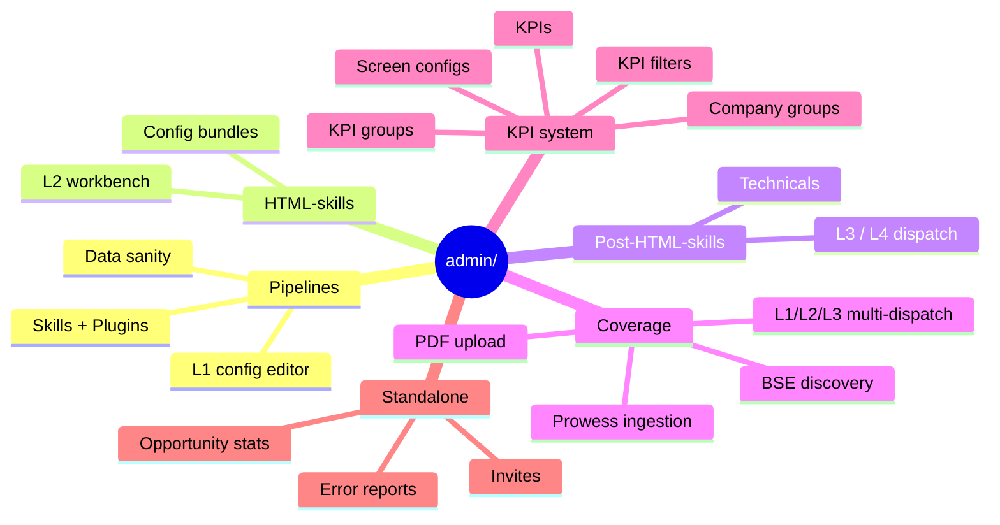
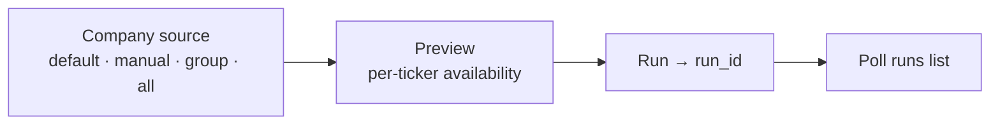
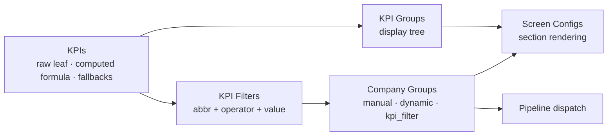

# Admin & Content-Ops Console

**The operator surface that runs the [analysis pipeline](pipeline-layers.md) and curates the KPI data
model.** Everything under [`src/app/(app)/admin/`](../src/app/(app)/admin/), gated by `hasAdminPrivileges`
(see [Routing & auth](routing-and-auth.md#admin-gated-routes)).

[← Back to docs hub](README.md)

---

## What lives here

All admin pages are client components that call the backend directly through the
[`api.ts`](../src/lib/api.ts) helpers with the `qc_at` bearer token. A `401` clears auth and bounces to
`/signin`; a `403` ("Admin access required") is surfaced by the page.

> [!IMPORTANT]
> The word **"skill" means three different backend tables** here. Keep them straight:
> `/admin/skills` (generic Skills/Plugins, incl. L1 `summarization` + technicals) · `/api/html-incremental-skills`
> (the **L2** engine) · `/api/post-html-analysis/configs` (the **L3/L4** engine, a fixed 4-row set).
> Full breakdown in [Pipeline & analysis layers](pipeline-layers.md#two-gotchas-worth-internalizing).

---

## 1. Pipelines

[`admin/pipelines/`](../src/app/(app)/admin/pipelines/) — the generic **Skill/Plugin registry** plus the
L1 signal-extraction config. Three tabs:

- **Skills library** (`SkillsLibraryTab` + `SkillDrawer` + `NewSkillDialog`) — CRUD over the flat skill
  library (name, model, `maxTokens`, `promptKey`, `promptTemplate`, `outputSchema`, `isActive`).
- **Plugin chain** (`PluginChainTab` + `PluginSidebar` + `SkillChainRow`) — a **Plugin is an ordered chain
  of Skills** for a category (`management | deal | opportunity | wealthos | technicals`). Add / remove /
  reorder skills in the selected plugin's chain.
- **L1 skill** (`L1SkillTab`) — the **L1 config editor** (the most important file here). Loads the skill
  with `slug === "summarization"` and edits its `config.signal_type_definitions[]` — the schema that
  governs exactly what L1 extracts. "Run Preview" executes the live LLM against a `callId` and shows the
  `signals[]` + `new_kpis[]` it would produce (60 s cooldown).
- **Data sanity** (`DataSanityTab`) — a read-only **provenance/debug** tool: given ticker + indicator +
  granularity + periods, shows how a computed metric was derived (raw / formula / delta / cagr / average).

> [!CAUTION]
> Saving the L1 config **invalidates all existing L1 signals** — the pipeline re-extracts on the next run.

<strong>Endpoints</strong>

- `GET/POST /admin/skills`, `GET/PUT/DELETE /admin/skills/:id`, `POST /admin/skills/:id/preview` (L1 preview)
- `GET /admin/plugins`, `GET/POST /admin/plugins/:id/skills`, `PUT /admin/plugins/:id/skills/order`,
  `DELETE /admin/plugins/:id/skills/:skillId`
- `GET /admin/indicators`, `GET /admin/indicators/:ticker/:metricId?granularity=&periods=` (data sanity)

## 2. HTML-skills (L2)

[`admin/html-skills/`](../src/app/(app)/admin/html-skills/) — authors and test-runs the **L2** skills that
turn L1 signals into per-lens HTML/text summaries. Base path `API_BASE = "/api/html-incremental-skills"`.

The workbench: pick a skill (grouped by category) → pick ticker + fiscal period (callId resolved via
[`useTranscriptCalls`](../src/hooks/useTranscriptCalls.ts)) → choose **Historic vs Incremental** mode →
optionally select a saved **config bundle** → Run / Export prompt / inspect Signals / History.
`SkillDetail` is the editor (prompt + per-source signal-type toggles + window sizes); `PreviewPane` runs
and renders the output. `ConfigsModal` manages named config bundles, which can be **pinned to a Company
Group** so bulk dispatch resolves them per ticker.

<strong>Endpoints (all under <code>/api/html-incremental-skills</code>)</strong>

- `GET /?includeInactive=true`, `GET/PUT /:slug`
- `GET/POST /:slug/configs`, `PUT/DELETE /:slug/configs/:key`
- `POST /:slug/run`, then poll `GET /api/jobs/:id`
- `GET /:slug/outputs/:ticker`, `…/:ticker/:fy/:q?historic=`, `…/:ticker/history?page=&size=`
- `GET /:slug/prompt/:ticker?callId=&historic=&configKey=` (prompt dry-run), `GET /:slug/signals/:ticker?historic=`
- `GET /api/transcript/stocks` (ticker list)

## 3. Post-HTML-skills (L3 / L4 + Technicals)

[`admin/post-html-skills/`](../src/app/(app)/admin/post-html-skills/) — on-demand dispatch and config
editing for **L3/L4** post-HTML analysis, plus the **technicals** track. Two tabs (Dispatch / Configs); the
Dispatch tab has a left rail toggling Post-HTML vs Technicals.

- **PostHtmlDispatchPanel** — pick ticker + Layer (L3/L4) + types + optional fiscal_year/quarter + force
  refresh → `POST /api/post-html-analysis` enqueues one job per type. L4 = single implicit `summary` type,
  needs an L3 first.
- **ConfigsPanel / ConfigEditor** — edit the fixed 4 config rows (prompt / output_schema / model /
  max_tokens / is_active); preview builds the real dataBlock + prompt and reports source availability.
- **Technicals** (`TechnicalsBulkPanel`, `TechnicalsConfigPanel/Editor`) — edits the `technical-intelligence`
  skill via `/admin/skills`; bulk runs via `/admin/technicals/bulk-analyze` + `/admin/technicals/bulk-status`.

> [!WARNING]
> This queue has **no job-status endpoint**. Completion is inferred by re-polling
> `GET /api/post-html-analysis?ticker=&layer_id=` and watching `updated_at` (3-min timeout).

## 4. Coverage

[`admin/coverage/`](../src/app/(app)/admin/coverage/) — the operational hub for **bulk dispatch** and
**ingestion**. Tabs: L1 / L2 / L3(=L3/L4) / Daily Runs / Prowess Ingestion / Prowess Coverage, plus modal
tools.

- **L1 / L2 / L3 multi-dispatch tabs** — each: pick a company **source** (`CompanySourcePicker`) → **preview**
  availability per ticker → **run** (returns a `run_id`) → poll a **runs** list. L2 resolves a per-group
  `config_key`; L3 targets `layerId` l3 or l4 with per-type readiness.
- **Prowess Ingestion** — upload a Prowess CSV (annual/quarterly → `prowess_values_new`, or daily/index →
  `nse_equity_new`). **Preview never writes**; it reports matched indicators, **unmatched columns** (add a
  KPI whose `prowess_name` = the column, then re-preview), then Run inserts.
- **Prowess Coverage** — read-only DB availability report (which KPIs/periods physically exist), exportable to CSV.
- **BSE discovery** (`BseDiscoveryPanel` + `BsePreviewModal`) — crawl BSE for PDFs (transcript / ppt /
  annual_report), browse discovered URLs with resolution status, preview PDF text page-by-page, then
  **approve** (writes into earnings_calls / annual_reports) or **dismiss**.
- **Modal tools** — `UploadPdfModal` (manual PDF when there's no crawlable URL), `KpiCleanupModal`
  (per-industry KPI dedup), `SignalBrowserModal` (browse extracted L1 signals), `TruncatedChunksModal`
  (find + split-retry truncated L1 chunk jobs).

<strong>Endpoints</strong>

- `POST /admin/pipeline-dispatch/{l1,l2,l3}-multi` (+ `/options`, `/preview`, `/run`, `/runs?limit=20`)
- `POST /admin/prowess/historic/preview`, `/admin/prowess/historic/run`
- `GET /admin/prowess/coverage/options`, `POST /admin/prowess/coverage/preview` (+ `/preview/csv`)
- `/admin/bse-discovery/{run,runs,urls,preview,approve,dismiss,undismiss}`
- `/admin/documents/upload/:docType` (manual PDF)
- `/admin/kpi-dedup/phase6/{preview,run}`, `/admin/pipeline-jobs/{truncated,truncated/split-retry,signals}`
- `POST /admin/company-groups/:slug/resolve` (source pickers resolve a group to tickers)

---

## The KPI system

Five metadata pages define the financial-data model that ingestion and the screener both depend on
(see the [KPI data-flow diagram](pipeline-layers.md#the-kpi-data-model-what-feeds-ingestion--screener)).
Each page is `page.tsx` + a `*FormDialog.tsx` + a `types.ts`.

| Page | What it defines |
|------|-----------------|
| [`admin/kpis/`](../src/app/(app)/admin/kpis/) | **KPI Catalogue.** A KPI is either a **raw leaf** (value from a Prowess column via `prowess_name`) or a **computed metric** (`formula_expression` over other abbrs). Has `frequency`, ordered `fallback_abbrs`, `kpi_type`, `denomination`; supports formula validation + preview-with-trace. |
| [`admin/kpi-groups/`](../src/app/(app)/admin/kpi-groups/) | **Display tree.** Parent/child nodes; leaves carry `kpi_abbr`, branches can be scoped to a `company_group_slug`. Organizes KPIs into screener sections. |
| [`admin/kpi-filters/`](../src/app/(app)/admin/kpi-filters/) | **Reusable threshold conditions** — `kpi_abbr` + operator (`> < >= <= = != between`) + value(s) + frequency. Attached to company groups to build membership. |
| [`admin/company-groups/`](../src/app/(app)/admin/company-groups/) | **Reusable ticker sets.** Three `filter_type`s: `manual` (ticker list), `dynamic` (ANDed doc-coverage windows / market cap / industries / name range), `kpi_filter` (attach filters + explicit recompute). Drives dispatch; L2 groups carry a `config_key`. |
| [`admin/screen-configs/`](../src/app/(app)/admin/screen-configs/) | **Screener display config.** Which metrics render in which section (12 known keys like `financials.pnl.annual`, `charts.pe-ratio`, `peers.columns`), order, formatting, per-group visibility. Financials sections can source rows from a KPI-group branch. |

<strong>Endpoints</strong>

- `GET/POST /admin/kpis` (`?search=`), `/:id`, `/:id/preview`, `/validate-formula`
- `GET/POST /admin/kpi-groups`, `/tree`, `/:id`
- `GET/POST /admin/kpi-filters`, `/:slug`
- `/admin/company-groups` (+ `/:slug`, `/:slug/resolve`, `/:slug/recompute`, `/:slug/filters[/:id]`)
- `/admin/screen-configs` (+ `/:key`, `/:key/items[/:id]`)

---

## Standalone admin pages

| Page | Purpose | Endpoints |
|------|---------|-----------|
| [`admin/invites/`](../src/app/(app)/admin/invites/) | Bulk beta-invite sender — parse emails, send, show per-email sent/skipped/failed. | `POST /admin/invites` |
| [`admin/error-reports/`](../src/app/(app)/admin/error-reports/) | Triage user-submitted issue reports; filter by status/category, change status, save notes. | `GET /admin/error-reports?page=&size=&status=&category=`, `PATCH /admin/error-reports/:id` |
| [`admin/opportunity/stats/`](../src/app/(app)/admin/opportunity/stats/) | KPI null-audit debug tool for the opportunity pillar; highlights nulls per period. | `GET /admin/opportunity/stats?callId=` |

---

### Related docs

- [Pipeline & analysis layers](pipeline-layers.md) — what L1–L4 are and how they connect.
- [Async job pipeline](async-jobs.md) — the polling model dispatch relies on.
- [Routing & auth](routing-and-auth.md) — how admin routes are gated.
- [Screener sub-pages](screener.md) — where the KPI/screen-config output is rendered.
