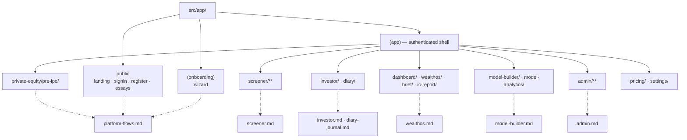
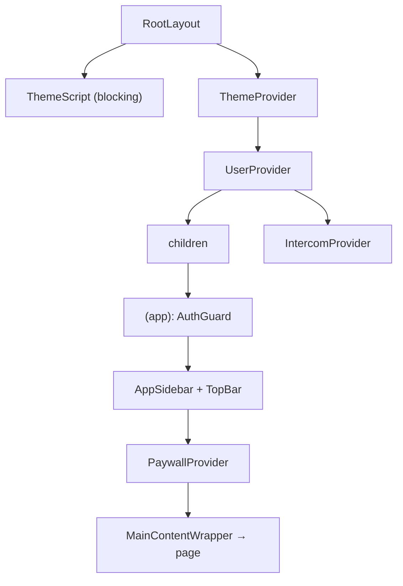

# Architecture

**Tech stack, App Router layout, the full route map, and the provider stack.**

[← Back to docs hub](README.md)

## Tech stack

| Concern | Choice |
|---------|--------|
| Framework | **Next.js 16** (App Router) |
| UI runtime | **React 19** |
| Language | **TypeScript 5** (`strict`) |
| Styling | **Tailwind CSS v4** (CSS-configured via `globals.css`) + **shadcn/ui** (`new-york`) |
| Design tokens | `--qc-*` CSS custom properties — see [Design system](design-system.md) |
| Charts | `recharts`, `apexcharts` / `react-apexcharts`, `lightweight-charts` |
| Tables | `@tanstack/react-table` |
| Graph/flow UI | `@xyflow/react` |
| Animation | `framer-motion` |
| Icons | `lucide-react` |
| Class utils | `class-variance-authority`, `clsx`, `tailwind-merge` |
| Analytics/support | GTM, Microsoft Clarity, Intercom (`@next/third-parties`) |

No global state library (no Redux/Zustand) — see [Data fetching](data-fetching.md#state-management).
No test framework.

## App Router layout

Source lives under [`src/`](../src/) (path alias `@/*` → `src/*`). Routes are under
[`src/app/`](../src/app/) and organized with **route groups** (folders in parentheses don't appear in
the URL):

```
src/app/
  layout.tsx            RootLayout — fonts, analytics, provider stack, blocking ThemeScript
  globals.css           the design-token source of truth
  page.tsx              /            marketing landing
  signin/ register/     /signin /register   auth (Google OAuth)
  essays/               /essays

  (onboarding)/         group — minimal shell
    onboarding/         /onboarding   multi-step wizard

  (app)/                group — the authenticated app shell (AuthGuard + sidebar + top bar)
    layout.tsx
    dashboard/          /dashboard            manager home
    investor/dashboard/ /investor/dashboard   investor home
    diary/              /diary                investment journal
    settings/ pricing/  ic-report/  brief/[clientId]/
    screener/           the asset-research terminal (see below)
    model-builder/ model-analytics/          model tooling (admin)
    private-equity/pre-ipo/                   pre-IPO list + detail
    wealthos/           advisor CRM workspace (admin)
    admin/              admin consoles (pipelines, kpis, coverage, …)
```

### Module map

Which route group owns which surface, and which doc covers it:



> [!NOTE]
> **Some pages are static prototypes** (hardcoded data, no backend fetch, not linked from nav): the manager
> [`/dashboard`](<../src/app/(app)/dashboard/page.tsx>), [`/brief/[clientId]`](<../src/app/(app)/brief/[clientId]/page.tsx>),
> [`/ic-report`](<../src/app/(app)/ic-report/page.tsx>), and [`/model-analytics`](<../src/app/(app)/model-analytics/page.tsx>).
> They're design references, not live features — see [WealthOS](wealthos.md#related-manager-surfaces--mostly-static-prototypes)
> and [Model builder](model-builder.md).

> [!CAUTION]
> **Unwired legacy component libraries.** [`components/opportunity/`](../src/components/opportunity/),
> [`components/deal/`](../src/components/deal/), and [`components/management/`](../src/components/management/)
> hold an older "factor detail" card surface **superseded by the unified `InsightTab`** and not imported by
> any route. Treat as legacy / cleanup candidates — see [Screener](screener.md#the-shared-insight-engine).

### The screener (asset terminal)

Under `src/app/(app)/screener/`, keyed by `?symbol=…`:

| Route | Page |
|-------|------|
| `/screener/home` | Screener landing (MF + stock-basket sections) |
| `/screener/overview` | Company overview (L4 rolled-up analysis) |
| `/screener/management` | Management factor → `<InsightTab type="management" />` |
| `/screener/opportunity` | Opportunity factor → `<InsightTab type="opportunity" />` |
| `/screener/deal` | Deal factor → `<InsightTab type="deal" />` |
| `/screener/fundamentals` | Financials |
| `/screener/technicals` | Technical analysis dashboard |
| `/screener/wyckoff` | Wyckoff phase analysis |
| `/screener/industry-intelligence` | Industry/sector intelligence (tabbed) |
| `/screener/mutual-funds`, `/screener/mutual-fund/[amfi_code]`, `/screener/mutual-fund-basket` | MF screener, detail, basket |
| `/screener/basket` | Stock basket |
| `/summary`, `/transcript` | Earnings-call summary and transcript views |

The three factor pages (`management`, `opportunity`, `deal`) are thin one-line delegators to a shared
engine — see [`insight-tab.tsx`](../src/components/insight/insight-tab.tsx) and
[Components](components.md#feature-directories). For a full page-by-page breakdown of the terminal, see
[**Screener**](screener.md).

## Provider stack

[`RootLayout`](../src/app/layout.tsx) loads the IBM Plex font family + Instrument Serif, injects
GTM/Clarity, runs a **blocking `ThemeScript`** (applies the stored theme before first paint to avoid a
flash), and wraps the tree:

```
ThemeProvider → UserProvider → { children, IntercomProvider }
```

The authenticated `(app)` group adds its own shell in [`(app)/layout.tsx`](<../src/app/(app)/layout.tsx>):

```
AuthGuard → AppSidebar + TopBar + PaywallProvider → MainContentWrapper
```



It also lazy-loads the Razorpay and smallcase checkout scripts. See
[Routing & auth](routing-and-auth.md) for `AuthGuard` and account types, and
[Data fetching](data-fetching.md#state-management) for what `UserProvider` holds.

## Conventions

- **URL is the state carrier.** Cross-page navigation passes context via query params — `?symbol=`
  (asset), `?callId=`, `?rmId=`. Pages read them with `useSearchParams()` **inside a `<Suspense>`
  boundary** (required by the App Router for these hooks).
- **Route-private code is co-located** using underscore folders that the router ignores:
  `_components/`, `_hooks/`, `_lib/` next to a `page.tsx`. Shared code lives under
  `src/components/`, `src/hooks/`, `src/lib/`.
- **Types** live in [`src/types/`](../src/types/); a small older set of models is in
  [`src/models/`](../src/models/) (`summary.ts`, `call.ts`). The hub type file is
  [`src/types/analysis.ts`](../src/types/analysis.ts).
- **Imports** use the `@/` alias, never long relative chains.

---

### Related docs

- [Pipeline & analysis layers](pipeline-layers.md) — the L1–L4 model behind the analysis routes.
- [Routing & auth](routing-and-auth.md) — how `AuthGuard` gates the `(app)` group.
- [Data fetching](data-fetching.md) — how pages get their data.
- Feature deep-dives: [Screener](screener.md) · [Investor](investor.md) · [WealthOS](wealthos.md) · [Admin](admin.md)
