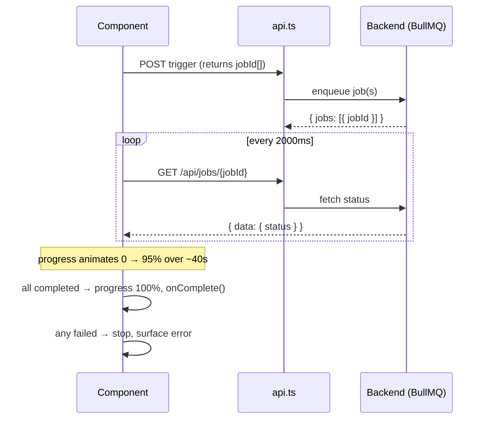

# Async job pipeline

AI analysis is slow (tens of seconds), so the backend runs it as **BullMQ jobs** and the frontend
**polls** for completion while animating a progress bar. Three hooks implement variations of the same
trigger → poll → animate → complete loop.

## The flow



Shared characteristics across all three hooks:

- **Poll interval:** `GET /api/jobs/{jobId}` every **2000 ms** (`setInterval`).
- **Progress animation:** a separate 100 ms `setInterval` eases progress from 0 → **95%** over
  **~40 s** (`step = 95 / (40000 / 100)`); it holds at 95% until the job actually finishes, then snaps
  to **100%**.
- **Terminal states:** all jobs `completed` → `progress = 100`, stop, fire `onComplete`. Any job
  `failed` → stop, surface the error. Both intervals are cleared on unmount.
- **Job status:** `type JobStatus = "pending" | "processing" | "completed" | "failed"`.

## The three hooks

### `useJobPoller` — generic poller

[`src/hooks/useJobPoller.ts`](../src/hooks/useJobPoller.ts). The lowest-level building block. You give
it job ids; it owns the polling + progress animation.

```ts
const { isPolling, progress, startPolling, stopPolling } =
  useJobPoller({ onComplete, onError, animationDuration });  // animationDuration default 40000
startPolling(jobIds);
```

It seeds every id to `pending`, polls immediately + on the 2 s interval, and resolves when all ids are
`completed` (or any `failed`).

### `useAnalyzeTrigger` — trigger + poll for insight pages

[`src/hooks/useAnalyzeTrigger.ts`](../src/hooks/useAnalyzeTrigger.ts). The full flow for the
factor pages:

```ts
const { isAnalyzing, analyzeError, aggregateStatus, progress, trigger } =
  useAnalyzeTrigger({ callId, types, onComplete });
```

`trigger()` does `POST /api/analysis` with body `{ callId, types }`
([`AnalysisTriggerResponse`](../src/types/analysis.ts)), collects `jobs[].jobId`, then polls each. It
derives an **`aggregateStatus`** with precedence `failed > completed > processing > pending`; the
progress animation runs while `processing`; on completion it waits 1 s then calls `onComplete`.

### `useAnalyzePipeline` — multi-step pipeline

[`src/hooks/useAnalyzePipeline.ts`](../src/hooks/useAnalyzePipeline.ts). For the opportunity full
pipeline, where a single job has multiple labelled steps:

```ts
const { isAnalyzing, analyzeError, pipelineSteps, handleAnalyze } = useAnalyzePipeline(callId);
```

`handleAnalyze()` does `POST /api/calls/{callId}/opportunity/analysis/full`, then polls
`GET /api/jobs/{jobId}` reading `data.all_steps` (each a
[`PipelineStep`](../src/types/management.ts) with `status` + `label`). It surfaces a step-level failure
as `Step "<label>" failed`, and on all-steps-completed does `window.location.reload()` after 1.5 s.

## Types & UI

- Job/pipeline types: [`src/types/management.ts`](../src/types/management.ts) — `JobStatus`,
  `JobStatusResponse`, `PipelineStep`, `PipelineJobStatusResponse`, `FullPipelineResponse`.
- Trigger types: [`src/types/analysis.ts`](../src/types/analysis.ts) — `AnalysisTriggerJob`,
  `AnalysisTriggerResponse`.
- UI: the management page triggers via
  [`analyze-prompt.tsx`](../src/components/management/analyze-prompt.tsx) /
  [`reanalyze-button.tsx`](../src/components/management/reanalyze-button.tsx); progress renders through
  [`ui/progress.tsx`](../src/components/ui/progress.tsx).
