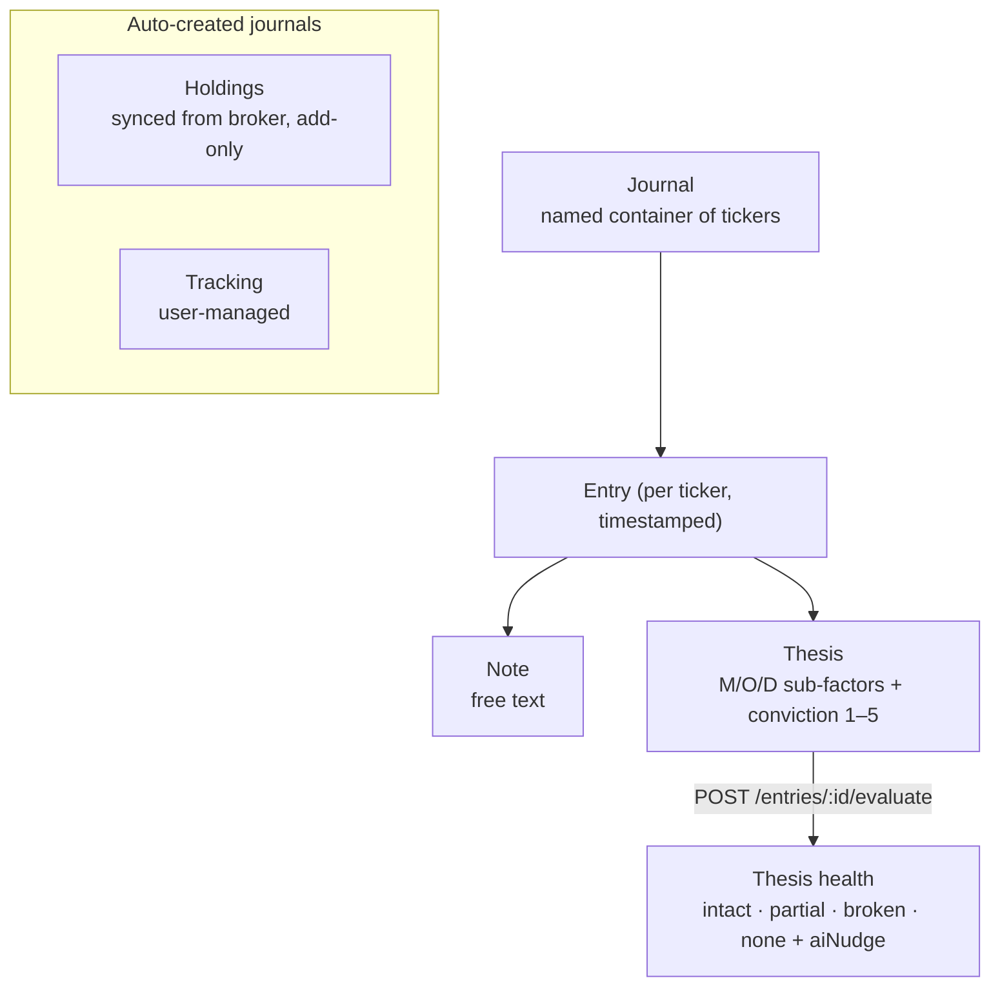

# Diary & Journal

**A personal investment journal.** The investor keeps **journals** (named containers of tickers) and writes
timestamped **entries** per ticker — a plain note or a structured **M/O/D thesis** with a conviction level.
Theses are AI-evaluated for **thesis health**. Page at
[`src/app/(app)/diary/`](<../src/app/(app)/diary/page.tsx>) + [`src/components/journal/`](../src/components/journal/).

[← Back to docs hub](README.md)

---

## Model

Two default journals are created server-side — **Holdings** (auto-synced from the connected broker, add-only)
and **Tracking** (user-managed) — plus any custom journals the user adds. An entry is either a **note** or a
structured **thesis** (Management / Opportunity / Deal sub-factors + a 1–5 conviction); the M/O/D
`SUB_FACTORS` lens set lives in [`types/journal.ts`](../src/types/journal.ts) and mirrors the L3 lenses from
`/api/post-html-analysis`.

## Page composition

- [`diary/page.tsx`](<../src/app/(app)/diary/page.tsx>) — composes the whole diary; owns modal/drawer state;
  wires the composer queue, watchlist, and ticker drawer.
- [`_hooks/useDiaryData.ts`](<../src/app/(app)/diary/_hooks/useDiaryData.ts>) — the **fan-out hook**: joins
  journal tree + smallcase holdings + MOD synopsis + what's-moving + stock universe + ticker metrics into one
  view model; exposes `refetch`, `syncHoldings`.
- [`_hooks/useQuantcaseRead.ts`](<../src/app/(app)/diary/_hooks/useQuantcaseRead.ts>) — the composer's AI
  "QuantCase read" per M/O/D dimension → **GET `/api/post-html-analysis?ticker=…&layer_id=l4`** (module-level
  cache keyed by ticker; one [L4](pipeline-layers.md) response serves all three pillars; `prefetchQuantcaseRead`
  warms the next card).
- [`_lib/diary-derive.ts`](<../src/app/(app)/diary/_lib/diary-derive.ts>) — pure derivations (no React/network):
  ticker view model, cross-journal joins, `latestThesis`, thesis-vs-watchlist sectioning, `computeStreak`,
  relative-time formatting.

The `_components/` folder holds the presentational pieces (masthead, entries strip, changed-since card,
everything-you-own, composer carousel + card, conviction slider, quantcase-read box, watchlist table,
journal tabs/badge).

## Journal actions → endpoints

Base `/api/journal`. Reads go through [`useJournalTree`](../src/hooks/useJournalTree.ts) (the diary's single
read — lazily creates the two default journals); writes are imperative via
[`useJournalMutations`](../src/hooks/useJournalMutations.ts) (no cache; callers refetch the tree).

<strong>Full endpoint map</strong>

| Action | Endpoint |
|--------|----------|
| Read the whole tree | **GET** `/journals` |
| Create / rename / delete journal | **POST/PATCH/DELETE** `/journals[/:id]` |
| Add / remove ticker | **POST** `/journals/:id/tickers`, **DELETE** `/journals/:id/tickers/:ticker` |
| Add entry (note or thesis) | **POST** `/journals/:id/tickers/:ticker/entries` |
| Edit / delete entry | **PATCH/DELETE** `/entries/:id` |
| AI re-evaluate thesis health | **POST** `/entries/:id/evaluate` |
| Pull broker holdings into Holdings journal | **POST** `/sync-holdings` |

## The completion wizard

[`journal-completion-wizard.tsx`](../src/components/journal/journal-completion-wizard.tsx) — a right-side
drawer that walks the user through a journal's pending (no-thesis) tickers **one stock per step**: stock
stepper header → `WizardStockContext` → four `WizardThesisFields` questions → Skip / Save-for-later /
Save & next (each saved via `addEntry`).

## Presentation helpers

- [`lib/journal-format.ts`](../src/lib/journal-format.ts) — the presentation source of truth: `dimColor/dimBg`
  (M = green / O = blue / D = accent), `CONV_LABELS` (Watching → Highest), `SF_HINTS` (per sub-factor coaching
  text), thesis-health & market-conviction → badge sentiment, `fmtPrice`.
- [`lib/journal-ideas.ts`](../src/lib/journal-ideas.ts) — empty-state data (`NIFTY50_TICKERS`,
  `DEFAULT_THESIS_PROMPTS`).

> [!NOTE]
> The diary reuses the investor module's broker link — `useSmallcaseHoldings`, and the
> `ConnectPortfolioModal` / `UploadPortfolioModal` from [Investor](investor.md) — and shares MOD scores via
> `useModSynopsis`.

---

### Related docs

- [Investor](investor.md) — shared broker holdings + MOD synopsis.
- [Pipeline & analysis layers](pipeline-layers.md) — the L4 "QuantCase read" and the M/O/D pillars.
- [`extras/specs/journal-backend-spec.md`](../extras/specs/journal-backend-spec.md) · [`extras/specs/diary-backend-changes.md`](../extras/specs/diary-backend-changes.md) — backend specs (archived).
