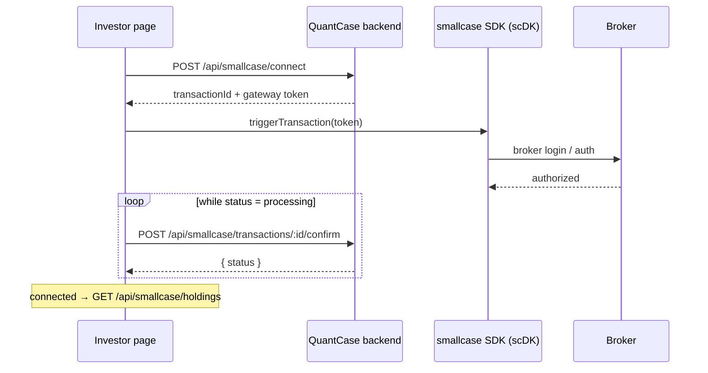

# Investor Dashboard & Portfolio

**The retail investor's home.** Shows a portfolio-level MOD synopsis, holdings, a research search hero, and
discover baskets. Broker linking and order placement run through the **smallcase Gateway SDK**. Page at
[`src/app/(app)/investor/dashboard/`](<../src/app/(app)/investor/dashboard/page.tsx>) +
[`src/components/investor/`](../src/components/investor/).

[← Back to docs hub](README.md)

---

## The dashboard

If `?ob=true`, the page renders onboarding; otherwise: a header with live NIFTY/SENSEX, then
Row 1 = `MODSynopsisCard` + `HoldingsPanel`, Row 2 = `ResearchHero`, Row 3 = `DiscoverScreens`, plus the MOD
breakdown drawer and Connect/Upload modals. Broker-connection state comes from `useUser()`
(`smallcase.is_connected`, `broker`).

| Concept | What it is |
|---------|-----------|
| **MOD synopsis** | A portfolio-level **Management / Opportunity / Deal** score (`mod-synopsis-card.tsx` → [`useModSynopsis`](../src/hooks/useModSynopsis.ts)). Overall score + serif headline (strongest/weakest pillar) + three sub-score tiles + "N holdings dragging your <pillar> score"; "Open MOD breakdown →" opens the per-symbol drawer. |
| **Shadow mode** | Pre-connection state. When no portfolio is linked, the top cards render with `isShadow` (sample/tracker data + a "Connect your portfolio" CTA) instead of real holdings. |
| **Research hero** | The live research entry point — searches companies (`GET /api/transcript/stocks`) and routes to `/screener/overview`. |

> [!NOTE]
> **Built but not currently mounted** on the dashboard (earlier/alt iterations): `shadow-portfolio`,
> `holdings-tracker`, `research-library-banner`, `market-view-card`, `industry-signals-grid`,
> `events-moving-market`, `community-discussion-row`. `place-order-modal` is mounted from the screener's
> [`asset-action-bar`](../src/components/molecules/asset-action-bar.tsx), not here.

## Portfolio sources

| Source | Hooks / endpoints |
|--------|-------------------|
| **First-party** (uploaded / tracked) | [`useUserPortfolio`](../src/hooks/useUserPortfolio.ts) → `/api/portfolio/user`; [`usePortfolioSummary`](../src/hooks/usePortfolioSummary.ts) → `/api/portfolio/summary`; `useModSynopsis` → `/api/portfolio/mod-synopsis`; CSV upload → **POST** `/api/portfolio/user/upload` |
| **Broker-linked** (smallcase) | [`useSmallcaseConnect`](../src/hooks/useSmallcaseConnect.ts), [`useSmallcaseHoldings`](../src/hooks/useSmallcaseHoldings.ts), [`useSmallcaseOrders`](../src/hooks/useSmallcaseOrders.ts) — see below |
| **Discover / market** | [`useDiscoverScreens`](../src/hooks/useDiscoverScreens.ts) → `/api/discover/screens`; [`useMarketIndices`](../src/hooks/useMarketIndices.ts); [`useResearchLibrarySummary`](../src/hooks/useResearchLibrarySummary.ts) → `/api/research-library/summary` |

## smallcase integration

[`src/lib/smallcase.ts`](../src/lib/smallcase.ts) wraps the `window.scDK` Gateway SDK (loaded in
[`(app)/layout.tsx`](<../src/app/(app)/layout.tsx>); the SDK only works on the whitelisted `quantcase.ai`
origin). The connect and order flows are broker-login handshakes bridged by the backend:

- **Connect** (`useSmallcaseConnect`) — `POST /api/smallcase/connect` → SDK `triggerTransaction` → poll
  `POST /api/smallcase/transactions/:id/confirm` while `status:"processing"`.
- **Holdings** (`useSmallcaseHoldings`) — `GET /api/smallcase/holdings` and `POST /api/smallcase/sync`
  (broker resync). Treats 404 / "not connected" as an empty, non-error state.
- **Orders** (`useSmallcaseOrders`) — `GET /api/smallcase/orders`; place via `POST /api/smallcase/orders` →
  SDK `triggerTransaction` → poll `/orders` until the newest hits a terminal state (~60 s ceiling). Final
  status is webhook-driven backend-side.

Types: [`types/smallcase.ts`](../src/types/smallcase.ts), [`types/investor-portfolio.ts`](../src/types/investor-portfolio.ts),
[`types/investor-dashboard.ts`](../src/types/investor-dashboard.ts).

> [!NOTE]
> The **same** smallcase holdings + MOD synopsis power the [Diary & Journal](diary-journal.md). MOD "dragging"
> symbols deep-link to `/screener/management?symbol=…`.

---

### Related docs

- [Diary & Journal](diary-journal.md) — shares holdings + MOD scores.
- [Pipeline & analysis layers](pipeline-layers.md) — the M/O/D pillars behind the MOD synopsis.
- [Platform flows](platform-flows.md) — onboarding & the paywall that wrap this dashboard.
- [`extras/specs/investor-dashboard-backend-spec.md`](../extras/specs/investor-dashboard-backend-spec.md) — backend spec (archived).
