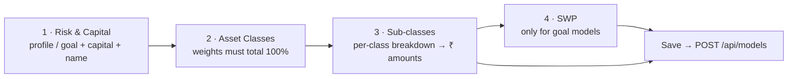

# Model Builder & Analytics

**Guided construction of reusable model portfolios.** Advisors build a model through a stepper, save it to a
shared library (`/api/models`), then fine-tune allocations, link clients, and attach holdings. Model
**Analytics** is a separate read-only view. Under
[`src/app/(app)/model-builder/`](<../src/app/(app)/model-builder/page.tsx>),
[`src/app/(app)/model-analytics/`](<../src/app/(app)/model-analytics/page.tsx>), and their component folders;
gated by `hasAdminPrivileges`.

[← Back to docs hub](README.md)

---

## The construction stepper

[`portfolio-builder-stepper.tsx`](../src/components/model-builder/portfolio-builder-stepper.tsx) drives a
3–4 step wizard (headers in `stepper-header.tsx`, types in `stepper-types.ts`, presets in
`stepper-constants.ts`):

| Step | File | What it does |
|------|------|--------------|
| **1 · Risk & Capital** | `step1-risk-capital.tsx` | Pick risk profile (conservative / balanced / aggressive / **goal-based**) or a goal (maps to a base profile); enter capital; name the portfolio. Seeds asset-class presets from `PRESET_ALLOCS`. |
| **2 · Asset Classes** | `step2-asset-classes.tsx` | Toggle/weight equity / debt / cash / commodities / alternatives. "Next" gated on weights summing to 100 %. |
| **3 · Sub-classes** | `step3-sub-classes.tsx` | Break each active class into sub-allocations (`SUB_CLASSES`), auto-computing rupee amounts. |
| **4 · SWP** | `step4-swp.tsx` | Only when a goal `hasSWP`: configure a Systematic Withdrawal Plan (passive income / retirement / child education) into a `SwpConfig` (corpus, method/rate, frequency, step-up, assumed CAGR, milestones). |

Saving calls [`useModels`](../src/hooks/useModels.ts)`.createModel` → **POST** `/api/models`, then routes to
`/model-builder/:id`.

## Routes

| Route | Page |
|-------|------|
| [`model-builder/`](<../src/app/(app)/model-builder/page.tsx>) | Model list (`ModelBuilderCard` grid) + "New Portfolio" opens the stepper modal. |
| [`model-builder/[id]`](<../src/app/(app)/model-builder/[id]/page.tsx>) | **Model detail/editor** — draft-vs-saved dirty tracking, summary tiles (capital / risk / #classes / total-allocation with over/under banner), `AssetClassForm` + `SubClassForm`, side panels `LinkedClientsPanel` + `ModelHoldingsPanel`. Saves via **PUT** `/api/models/:id`, deletes via **DELETE**. |
| [`model-analytics/`](<../src/app/(app)/model-analytics/page.tsx>) | Allocation breakdown, drift-vs-target, position IC scores, AUM/position stats. |

## Hooks → endpoints

- [`useModels`](../src/hooks/useModels.ts) → **GET/POST** `/api/models`, **PUT/DELETE** `/api/models/:id`
  (optimistic local list). Types in [`types/portfolio.ts`](../src/types/portfolio.ts) (`StoredModel`,
  `PortfolioData`, `RiskProfileType`, `GoalType`, `SwpConfig`).
- [`useWealthModels`](../src/hooks/useWealthModels.ts) → **GET** `/api/wealthos/models` — a *different,
  read-only* list used inside WealthOS client-detail for assignment.

> [!IMPORTANT]
> **One model concept, three surfaces.** The builder stepper and `/api/models` store are **shared with
> WealthOS**: [`wealthos/models`](wealthos.md) uses `useModels` + the same stepper and links rows to
> `/model-builder/:id`. But client-detail's Assign/Remove reads the **parallel** `/api/wealthos/models` list —
> don't conflate the two stores.

> [!WARNING]
> [`model-analytics/`](<../src/app/(app)/model-analytics/page.tsx>) is a **static demo** — it reads
> `PORTFOLIOS` from [`portfolio-data.ts`](../src/components/model-analytics/portfolio-data.ts), makes no
> backend calls, and reuses `components/dashboard/{stat-card,section-divider}`.

---

### Related docs

- [WealthOS](wealthos.md) — where models get assigned to clients.
- [Data fetching](data-fetching.md) — the `useModels` / `authFetch` pattern.
- [Routing & auth](routing-and-auth.md) — how these routes are admin-gated.
