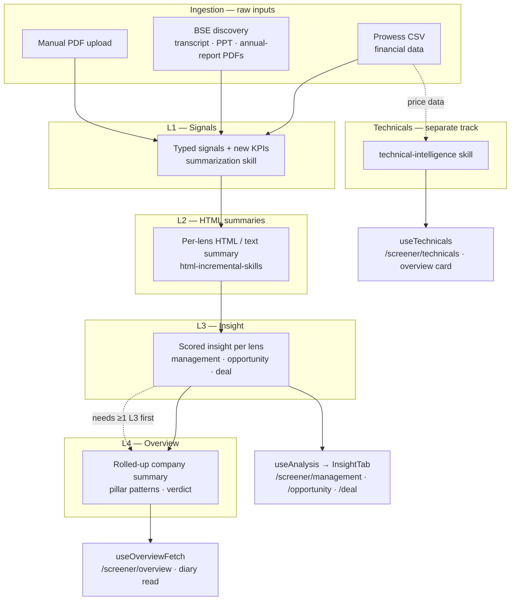
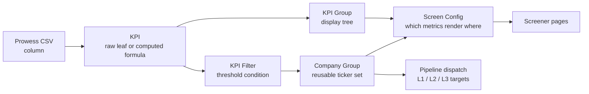

# Pipeline & Analysis Layers

**The `L1 → L2 → L3 → L4` pipeline that turns raw company disclosures into scored, narrative research.**
This is the single most important mental model in QuantCase — almost every data-driven page is a view over
one of these layers.

[← Back to docs hub](README.md)

---

## The big picture

Data flows through numbered **layers**, each produced by a different engine and stored in its own backend
table. The frontend never runs these — it **triggers** them (admin dispatch or per-page re-analyse) and
**reads** their output.

---

## The layers at a glance

| Layer | What it is | Produced by | Read on the frontend by | Endpoint |
|-------|------------|-------------|-------------------------|----------|
| **Ingestion** | Raw source docs + financial data | Prowess CSV upload · BSE crawl · manual PDF | — (admin only) | `/admin/prowess/*`, `/admin/bse-discovery/*` |
| **L1** | Structured **typed signals** + newly-discovered KPIs extracted from transcripts / PPTs / annual reports | `summarization` skill (LLM) | — (feeds L2) | dispatch `/admin/pipeline-dispatch/l1-multi` |
| **L2** | Per-lens **HTML / text summaries** (one per pillar), in Historic or Incremental mode | HTML Incremental Skills | — (feeds L3) | `/api/html-incremental-skills/*` |
| **L3** | Structured **insight** per pillar — score, lenses, thesis, verdict, signal map | Post-HTML analysis config (`layer_id=l3`) | [`useAnalysis`](../src/hooks/useAnalysis.ts) → [`InsightTab`](../src/components/insight/insight-tab.tsx) | `GET /api/post-html-analysis?ticker=&layer_id=l3` |
| **L4** | A single **rolled-up summary** across the three pillars (`pillar_patterns`, watch-outs, verdict) | Post-HTML analysis config (`layer_id=l4`, type `summary`) | [`useOverviewFetch`](../src/hooks/useOverviewAnalysis.ts) → `/screener/overview` | `GET /api/post-html-analysis?ticker=&layer_id=l4` |
| **Technicals** | Technical-intelligence analysis per ticker (separate track) | `technical-intelligence` skill | [`useTechnicals`](../src/hooks/useTechnicals.ts) → `/screener/technicals` | `GET /api/screener/{ticker}/technicals` |

The three **pillars** (a.k.a. factors / lenses) are **Management**, **Opportunity**, and **Deal** — the
same triad that powers the screener factor pages, the investor MOD synopsis, and the journal thesis fields.

---

## How the frontend consumes each layer

One backend endpoint — `GET /api/post-html-analysis` — powers most narrative surfaces; the `layer_id`
query param selects L3 vs L4:

- **L3** ([`useAnalysis.ts`](../src/hooks/useAnalysis.ts)) hard-codes `LAYER_ID = 'l3'`, hits
  `…?ticker=&layer_id=l3`, and runs the wire results through
  [`adaptL3Results`](../src/lib/analysis-adapter.ts) (normalizes each lens to `max_score = 100`, applies
  display-name overrides, derives top key signals). It exposes `getInsight(type)` → the first `available`
  insight of that `InsightType`. The per-factor hooks are one-line wrappers:
  [`useManagementAnalysis`](../src/hooks/useManagementAnalysis.ts),
  [`useDealAnalysis`](../src/hooks/useDealAnalysis.ts),
  [`useOpportunityAnalysis`](../src/hooks/useOpportunityAnalysis.ts).
- **L4** ([`useOverviewAnalysis.ts`](../src/hooks/useOverviewAnalysis.ts)) hard-codes `LAYER_ID = 'l4'`,
  adapts the single `summary` result via [`adaptL4Results`](../src/lib/overview-adapter.ts) into
  `OverviewAnalysis`, and also exposes `refetch`.

Wire shapes for both layers live in [`src/types/analysis.ts`](../src/types/analysis.ts)
(`L3Result` / `L3ResultBody`, `L4Result` / `L4SummaryBody`, `L3AnalysisResponse`, `L4AnalysisResponse`).

> [!TIP]
> Want to know which page reads which layer? See [Screener sub-pages](screener.md) for L3/L4/technicals,
> and [Diary & Journal](diary-journal.md) for the L4-powered "QuantCase read".

---

## Triggering analysis (async jobs)

L1 and L2 dispatch return a `run_id` / `jobId` with a real status endpoint. The **L3/L4 post-HTML queue is
different** — see the warning below. The full trigger → poll → animate loop for the factor pages is
documented in [Async job pipeline](async-jobs.md).

> [!WARNING]
> **The L3/L4 (`post-html-analysis`) queue has no job-status endpoint.** After `POST /api/post-html-analysis`
> enqueues one job per type, the dispatch UI can't ask "is job X done?" — it re-polls
> `GET /api/post-html-analysis?ticker=&layer_id=` every 2 s and treats a fresher `updated_at` as completion
> (with a ~3 min timeout). This is unlike the L1/L2 flows, which return a `run_id` and a real status.

---

## The KPI data model (what feeds ingestion → screener)

Financial data has its own metadata chain, curated entirely in the [admin console](admin.md). It's what
turns a raw Prowess CSV column into a formatted number on the screener:

In one line: **Prowess columns → KPIs (raw + computed + fallbacks) → organized by KPI Groups → thresholds
as KPI Filters → combined into Company Groups (which drive dispatch and gate visibility) → rendered per
Screen Configs.** Each piece is documented in [Admin & content-ops](admin.md#the-kpi-system).

---

## Two gotchas worth internalizing

> [!IMPORTANT]
> **"Skill" means three different things** depending on which admin page you're on:
> 1. **Generic Skills + Plugins** — `/admin/skills`, `/admin/plugins`. The L1 `summarization` skill and the
>    `technical-intelligence` skill live here. Managed by the [Pipelines](admin.md#1-pipelines) page.
> 2. **HTML Incremental Skills** — `/api/html-incremental-skills`. The **L2** engine (a different table with
>    its own per-skill config bundles). Managed by [HTML-skills](admin.md#2-html-skills-l2).
> 3. **Post-HTML Analysis configs** — `/api/post-html-analysis/configs`. The **L3/L4** engine, a *fixed*
>    4-row set (l3 management/opportunity/deal + l4 summary), seeded not created.

> [!NOTE]
> **L4 depends on L3.** The rolled-up overview needs at least one L3 insight to exist for the ticker before
> it can be produced — the `summary` config reads L3 output as its source.

---

### Related docs

- [Admin & content-ops](admin.md) — how each layer is dispatched, and the full KPI system.
- [Async job pipeline](async-jobs.md) — the trigger → poll → animate loop.
- [Data fetching](data-fetching.md) — the `api.ts` layer and adapter functions.
- [Screener sub-pages](screener.md) — where L3 / L4 / technicals get rendered.
