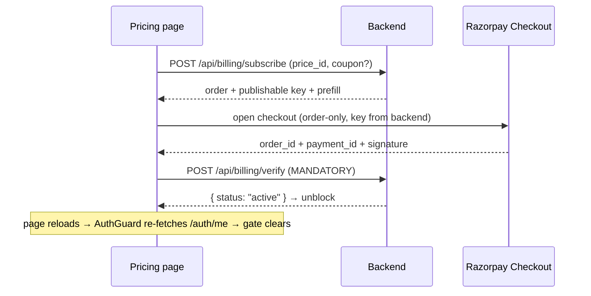
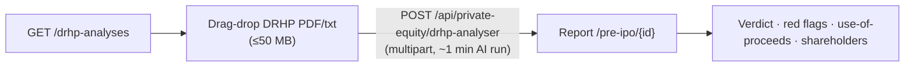

# Platform Flows

**The cross-cutting flows that wrap every feature module** — onboarding, billing/paywall, auth, marketing,
and the private-equity/DRHP analyser.

[← Back to docs hub](README.md)

---

## 1. Onboarding

Route group [`src/app/(onboarding)/`](<../src/app/(onboarding)/layout.tsx>) with its own layout guarded by
[`OnboardingGuard`](../src/components/providers/OnboardingGuard.tsx): no token → `/signin`;
`qc_onboarding_completed === "true"` → `/investor/dashboard`; else render. The wizard
([`onboarding/page.tsx`](<../src/app/(onboarding)/onboarding/page.tsx>)) drives 6 framer-motion slides
(`Slide1HowItWorks … Slide6PickAFew`, mostly educational).

- Each **Next** persists progress via **PATCH** `/api/auth/me/onboarding` (`{ onboarding_step, onboarding_completed }`).
- Completion sets `localStorage["qc_onboarding_completed"] = "true"` and routes to `/investor/dashboard`.
- The complementary gate is in [`AuthGuard`](../src/components/providers/AuthGuard.tsx) — see
  [Routing & auth](routing-and-auth.md#authguard-flow).

## 2. Billing / paywall / pricing

Files: [`pricing/page.tsx`](<../src/app/(app)/pricing/page.tsx>),
[`PaywallOverlay`](../src/components/paywall/PaywallOverlay.tsx),
[`PaywallProvider`](../src/components/providers/PaywallProvider.tsx),
[`useRazorpayCheckout`](../src/hooks/useRazorpayCheckout.ts), [`lib/billing.ts`](../src/lib/billing.ts).
The Razorpay script is loaded in [`(app)/layout.tsx`](<../src/app/(app)/layout.tsx>).

**Gating:** `GET /api/auth/me` returns `subscription`; `UserContext` exposes `isAccessBlocked =
subscription.is_access_blocked`. `PaywallProvider` wraps all app content — when blocked it **blurs + disables**
the page and mounts a hard-block dialog; a soft dialog opens from the trial badge (`openPaywall`).

> [!CAUTION]
> **The Razorpay key is never hardcoded** — it always comes from `/api/billing/config` or the `/subscribe`
> response (backend-only test↔live switch). And a payment is only "paid" after **`POST /api/billing/verify`**
> succeeds with `status:"active"`; a webhook is the backstop.

<strong>Billing endpoints</strong> (see <a href="../src/lib/billing.ts">lib/billing.ts</a>)

- `GET /api/billing/config` (no auth — mode + key) · `GET /api/billing/products`
- `POST /api/billing/subscribe` · `POST /api/billing/verify` · `POST /api/billing/coupons/validate`
- `GET /api/billing/subscription`

## 3. Auth screens

Files: [`signin/page.tsx`](../src/app/signin/page.tsx) + `components/signin/*`;
[`register/page.tsx`](../src/app/register/page.tsx) + `components/register/RegisterForm.tsx`. Google OAuth via
[`google-signin-button`](../src/components/molecules/google-signin-button.tsx) (`GOOGLE_CLIENT_ID`).

- **Sign-in** — `POST /api/auth/signin` → store `qc_at`/`qc_rt` → always `GET /api/auth/me` to resolve
  `accountType` + onboarding → route to `/onboarding`, the safe `?next=`, or `/dashboard` vs
  `/investor/dashboard` (via `usesInvestorFlow`). `safeNext()` blocks open redirects.
- **Register — invite-only.** `RegisterForm` first calls `GET /api/invites/validate?token=` (handles
  404/410 used/expired, locks the email), then `POST /api/auth/register` → sets
  `qc_onboarding_completed="false"` → `/onboarding`.
- Google path (`POST /api/auth/google`) is shared by both.

## 4. Landing & essays

[`src/app/page.tsx`](../src/app/page.tsx) composes [`components/landing/*`](../src/components/landing/) in
order (Navbar, Hero, ResearchDesk, ModFramework, PoweredByAi, LiveExample, Portfolio, Journal, FinalCta,
Footer + `CinematicCanvas`). Static marketing, cream theme, CTAs → `/signin`.
[`essays/page.tsx`](../src/app/essays/page.tsx) is a standalone "essays — coming soon" page sharing the landing
navbar/footer. Landing routes are in `AuthGuard`'s `PUBLIC_PATHS` (`/`, `/signin`, `/register`).

## 5. Private equity / pre-IPO / DRHP

Files: [`private-equity/pre-ipo/page.tsx`](<../src/app/(app)/private-equity/pre-ipo/page.tsx>) (uploader +
past-analyses list), [`[id]/page.tsx`](<../src/app/(app)/private-equity/pre-ipo/[id]/page.tsx>) (report with
Verdict / Red Flags / Pricing tabs), [`components/drhp/*`](../src/components/drhp/); types in
[`types/drhp.ts`](../src/types/drhp.ts).

The list loads via `GET /api/private-equity/drhp-analyses`; the detail page fetches
`GET /api/private-equity/drhp-analyses?id={id}` and renders hero metrics (issue size, OFS ratio, fresh issue,
EBITDA margin, fair value), a quick verdict, severity-ranked red flags, and proceeds/shareholder tables.
Reachable from the [screener home](screener.md) PE/Pre-IPO card.

---

### Related docs

- [Routing & auth](routing-and-auth.md) — `AuthGuard`, account types, the guard order.
- [Investor](investor.md) — the dashboard that onboarding and the paywall wrap.
- [Architecture](architecture.md) — the provider stack these flows plug into.
