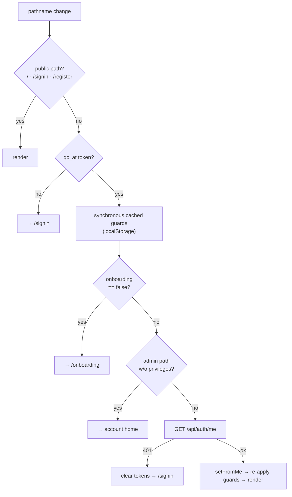

# Routing & auth

**`AuthGuard`, account types and access flows, admin gating, and the URL-param state convention.**

[← Back to docs hub](README.md)

## The auth model

Auth is **token-based, client-side**. On sign-in the backend issues a bearer token that the app stores
in `localStorage["qc_at"]` (access token) alongside `qc_rt` (refresh token). Every API helper attaches
`Authorization: Bearer <qc_at>` automatically (see [Data fetching](data-fetching.md)).

There is **no middleware**. Access control is enforced client-side by
[`AuthGuard`](../src/components/providers/AuthGuard.tsx), mounted in the `(app)` route-group layout so
it wraps every authenticated page.

## AuthGuard flow



On every pathname change, `AuthGuard`:

1. **Skips public paths** — `["/signin", "/", "/register"]` need no auth.
2. **Requires a token** — no `qc_at` → redirect to `/signin`.
3. Runs **synchronous cached guards** (using `localStorage`, before any network call, to avoid a flash
   of the wrong page):
   - `qc_onboarding_completed === "false"` → redirect to `/onboarding`.
   - investor-flow account on `/dashboard` → redirect to `/investor/dashboard`.
   - admin-only path without admin privileges → redirect to the account's home.
4. Fetches the **authoritative** `GET /api/auth/me`:
   - `401` → clear tokens (`qc_at`, `qc_rt`, `qc_account_type`, `qc_onboarding_completed`) and go to
     `/signin`.
   - otherwise `setFromMe(data)` hydrates `UserContext`, then re-applies the onboarding / dashboard /
     admin guards against the fresh data.

> A locally-confirmed `qc_onboarding_completed === "true"` is never downgraded by a possibly-stale
> `/me` response — this avoids a race between the onboarding-complete PATCH and this GET.

## Account types & flows

Defined in [`UserContext.tsx`](../src/components/providers/UserContext.tsx):

```ts
type AccountType = "manager" | "investor" | "admin" | null;
```

Two helpers derive behavior from the account type — use these rather than comparing strings inline:

| Helper | True for | Meaning |
|--------|----------|---------|
| `usesInvestorFlow(t)` | `investor`, `admin` | Uses the investor UX (investor dashboard + sidebar). Home = `/investor/dashboard`. |
| `hasAdminPrivileges(t)` | `manager`, `admin` | Sees privileged nav items and admin routes. Manager home = `/dashboard`. |

`admin` intentionally mirrors the **investor** flow for its home/landing while retaining privileged
access everywhere else.

## Admin-gated routes

These path prefixes require `hasAdminPrivileges`:

```
/admin   /wealthos   /model-builder   /model-analytics
```

Accounts without privileges are redirected to their home (`homePathFor` → investor or manager
dashboard).

## localStorage keys

The auth/session cache (written by `UserContext.setFromMe` and `AuthGuard`):

| Key | Holds |
|-----|-------|
| `qc_at` / `qc_rt` | access / refresh tokens |
| `qc_account_type` | `manager` \| `investor` \| `admin` |
| `qc_onboarding_completed` | `"true"` / `"false"` |
| `qc_user_id`, `qc_display_name`, `qc_email` | cached profile fields |
| `qc-theme` | active theme id (`purple` \| `dark-purple`) — written by the theme system |

## URL-param state

Navigation carries context in query params rather than router state or a store:

- `?symbol=…` — the active asset across screener pages.
- `?callId=…` — an earnings-call id (summary/transcript/analysis).
- `?rmId=…` — a relationship-manager id (WealthOS/advisor views).

Pages read them via `useSearchParams()` inside a `<Suspense>` boundary (see the pattern in
[`insight-tab.tsx`](../src/components/insight/insight-tab.tsx)).

---

### Related docs

- [Platform flows](platform-flows.md) — onboarding, billing/paywall, and the auth screens themselves.
- [Data fetching](data-fetching.md) — how `authFetch` attaches the token and handles 401.
- [Architecture](architecture.md) — where `AuthGuard` sits in the provider stack.
