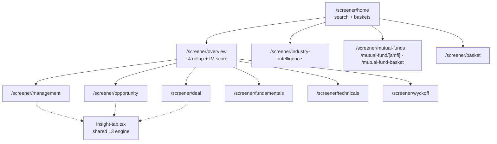

# Screener — the Asset Terminal

**The company-research terminal, keyed by `?symbol=`.** Every sub-page is a lens on one ticker; most wrap
their content in `ScreenerPageShell` + `AssetActionBar` and read
[`useScreenerData(symbol)`](../src/hooks/useScreenerData.ts) → `GET /api/screener/{symbol}` for the shared
company header.

[← Back to docs hub](README.md)

---

## Sub-page map

| Route | What it shows | Feeds from |
|-------|---------------|-----------|
| [`home`](<../src/app/(app)/screener/home/page.tsx>) | Search-first landing; asset tabs (Indian stocks / MF / US "soon" / PE-Pre-IPO); research baskets + MF screener. | `GET /api/transcript/stocks` |
| [`overview`](<../src/app/(app)/screener/overview/page.tsx>) | **L4** rolled-up company overview + client-computed **IM score** (mean of available M/O/D L3 scores → Strong Buy…Sell), technical snapshot, sticky Decision Intelligence panel. | `useOverviewFetch` (L4), `useAnalysis` (L3), `useTechnicals`, `useScreenerData` |
| [`management`](<../src/app/(app)/screener/management/page.tsx>) · [`opportunity`](<../src/app/(app)/screener/opportunity/page.tsx>) · [`deal`](<../src/app/(app)/screener/deal/page.tsx>) | The three **factor pages** — thin delegators to the shared insight engine (below). | `useAnalysis` (L3) |
| [`fundamentals`](<../src/app/(app)/screener/fundamentals/page.tsx>) | P&L / balance-sheet / cash-flow tables, growth & returns cards, combo charts, treemap, cash-flow waterfall, peer table, shareholding. | `useFinancials`, `useFinancialsCharts`, `useShareholding`, `useScreenerPeers` |
| [`technicals`](<../src/app/(app)/screener/technicals/page.tsx>) | Technical-analysis surface — candlestick, levels, rule engine, scorecard, Decision Intelligence (see [below](#technicals-deep-dive)). | `useTechnicals`, `usePrices` |
| [`wyckoff`](<../src/app/(app)/screener/wyckoff/page.tsx>) | Server-computed Wyckoff phase / sub-phase, confidence, zigzag structure, OHLCV chart. | `useWyckoff` |
| [`industry-intelligence`](<../src/app/(app)/screener/industry-intelligence/page.tsx>) | 7-tab sector intelligence (dashboard / rankings / deep-dive / rotation-alerts / universe / news). | `useIndustryIntelligence`, `useIndustryBaskets` |
| [`mutual-funds`](<../src/app/(app)/screener/mutual-funds/page.tsx>) · [`mutual-fund/[amfi_code]`](<../src/app/(app)/screener/mutual-fund/[amfi_code]/page.tsx>) · [`mutual-fund-basket`](<../src/app/(app)/screener/mutual-fund-basket/page.tsx>) | MF screener grid, single-scheme detail, curated MF baskets. | `useMfScreener`, `useMfFilterOptions`, `useMfBaskets`, `useMfBasketSchemes` |
| [`basket`](<../src/app/(app)/screener/basket/page.tsx>) | TanStack-Table screener over a stock basket; row-select → add-to-journal. | `useBaskets`, `useBasketStocks`, `useJournalTree` |

---

## The shared insight engine

`management` / `opportunity` / `deal` are **5-line re-exports** — each is just
`<InsightTab type="…" />`. All the work is in
[`components/insight/insight-tab.tsx`](../src/components/insight/insight-tab.tsx), which calls
[`useAnalysis`](../src/hooks/useAnalysis.ts) (L3) → `getInsight(type)` and renders the scorecard, lenses,
signal map, thesis, key signals, and a lens drawer ([`useLenses`](../src/hooks/useLenses.ts) →
`/api/lenses?ticker=`). Empty analysis renders a clean `InsightEmptyState` inside the normal shell.

> [!NOTE]
> One frontend-only trick: the **Deal page clones the Opportunity page's `industry-analysis` lens** onto its
> radar/tiles — no extra fetch. See [`insight-tab.tsx`](../src/components/insight/insight-tab.tsx).

> [!CAUTION]
> **Legacy factor-card libraries are not wired to any route.** The large
> [`components/opportunity/`](../src/components/opportunity/), [`components/deal/`](../src/components/deal/),
> and [`components/management/`](../src/components/management/) card sets (score-breakdown, financial-strength,
> transcript-drivers, eps-engine, target-price-matrix, …) — and their `/api/opportunity/*` hooks
> (`useOpportunityPrompt`, `usePeerData`) — are an **older factor-detail surface superseded by
> `InsightTab`**. They're currently unmounted; treat as legacy / cleanup candidates.

---

## Technicals deep-dive

[`technicals/page.tsx`](<../src/app/(app)/screener/technicals/page.tsx>) is the largest sub-page. Key pieces:

- **Rule engine** (`TechnicalsRuleEngine.tsx`) — 4 tabs: STRUCTURE / TREND / TIMING / DOMINANCE (the last is
  still keyed `relativeStrength` on the backend), plus a manual Growth/Value perspective toggle seeded by the
  classifier.
- **Scoring** — [`lib/technicals-scores.ts`](../src/lib/technicals-scores.ts) defines **7 weighted modules**
  summing to 100: Structure/Wyckoff 20, Trend-SMA 20, Momentum-RSI 15, Trend-Maturity-ADX 15, Leadership-RS
  15, Capital-Flow 10, Volatility-BBW 5.
- **Normalization** — [`lib/technicals-normalize.ts`](../src/lib/technicals-normalize.ts) flattens the API
  envelope and tolerates legacy narrative-vs-envelope shapes; `lib/technicals-indicators.ts` resolves
  indicators by id (with legacy-name fallback).
- **Refresh** — a 60 s-cooldown button enqueues a new LLM job; [`useTechnicals`](../src/hooks/useTechnicals.ts)
  self-schedules a poll against `/api/screener/{symbol}/technicals/status` (20 s initial, 10 s interval, ~3 min
  ceiling) while the insight is `generating`.

> [!NOTE]
> The score-**direction** badge is deliberately parked (±5 model noise), and Wyckoff prices are **not
> split-adjusted** upstream — `types/wyckoff.ts`'s `WyckoffMeta` carries split-detection / truncation flags
> so the UI can warn. Insufficient history on Wyckoff is a **200 with `meta.insufficientData`**, not an error.

> [!IMPORTANT]
> [`useIndustryIntelligence`](../src/hooks/useIndustryIntelligence.ts) **deep-merges live data against a
> checked-in sample JSON** (`temp/config/industry-intelligence-response.json`) so gaps still render. That's a
> real runtime dependency, not just a dev fixture — keep it in mind when changing the payload.

---

### Related docs

- [Pipeline & analysis layers](pipeline-layers.md) — where the L3 / L4 / technicals data comes from.
- [Management dashboard spec](page-management.md) — widget-level spec for the management factor page.
- [AI transcript spec](page-ai-transcript.md) — the transcript-analysis flow.
- [Data fetching](data-fetching.md) — the hook + adapter conventions these pages use.
