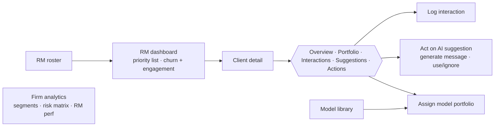

# WealthOS — Advisor CRM

**The advisor-facing workspace for a wealth-management firm.** A Relationship Manager (RM) works a ranked
"who needs attention today" list, opens clients, reviews portfolio + AI suggestions, logs interactions, and
assigns model portfolios. Everything under [`src/app/(app)/wealthos/`](<../src/app/(app)/wealthos/>) +
[`src/components/wealthos/`](../src/components/wealthos/); gated by `hasAdminPrivileges`.

[← Back to docs hub](README.md)

---

## The advisor loop

## Routes

| Route | Page |
|-------|------|
| [`wealthos/`](<../src/app/(app)/wealthos/page.tsx>) | Redirects to `/wealthos/dashboard`. |
| [`wealthos/dashboard`](<../src/app/(app)/wealthos/dashboard/page.tsx>) | **RM priority dashboard.** "Viewing as" RM selector; "Generate Suggestions" POSTs a job then polls; priority list grouped HIGH/MEDIUM/LOW with churn % + score. |
| [`wealthos/clients`](<../src/app/(app)/wealthos/clients/page.tsx>) | Paginated, searchable, segment/RM-filtered client registry with a segment-breakdown side panel. |
| [`wealthos/clients/[clientId]`](<../src/app/(app)/wealthos/clients/[clientId]/page.tsx>) | **Client detail** — tabs Overview / Portfolio / Interactions / Suggestions / Actions (each lazy-loads its hook on first activation). Overview lists approved models with Assign/Remove. |
| [`wealthos/clients/new`](<../src/app/(app)/wealthos/clients/new/page.tsx>) | Create-client form. |
| [`wealthos/models`](<../src/app/(app)/wealthos/models/page.tsx>) | **Model library** (shared with [Model Builder](model-builder.md) — uses `useModels` → `/api/models`); opens the builder stepper in a modal. |
| [`wealthos/rms`](<../src/app/(app)/wealthos/rms/page.tsx>) | RM roster ranked by performance; select an RM → assigned clients + analytics panel; `CreateRMForm` to add RMs. |
| [`wealthos/analytics`](<../src/app/(app)/wealthos/analytics/page.tsx>) | Firm-wide: segment performance bar chart, risk-profile matrix, per-RM performance. |

## Domain glossary

| Term | Meaning |
|------|---------|
| **RM** | Advisor who owns a book of clients; has `performance_score`, `team`, client count. |
| **Client** | Investor with `segment` (UHNI / HNI / Retail / Institutional / Private), `risk_profile`, `engagement_score`, `churn_probability`, portfolio. |
| **Model** | Reusable model portfolio (asset-class allocation) assigned to clients — see [Model Builder](model-builder.md). |
| **Interaction** | Logged touchpoint (call / email / whatsapp / meeting) on the client timeline. |
| **Suggestion** | AI next-best-action per client (priority, `suggested_action`, `reason`, `talking_points`, optional drafted `message`); status `pending → used/ignored` feeds the RM's "suggestion adoption rate". |

## Hooks → endpoints

All under `/api/wealthos` (GET unless noted). Types in [`src/types/wealthos.ts`](../src/types/wealthos.ts).

<strong>Full endpoint map</strong>

| Hook / component | Endpoint |
|------------------|----------|
| [`useWealthClients`](../src/hooks/useWealthClients.ts) | `/clients?page&size&segment&rm_id&search` |
| [`useWealthClient`](../src/hooks/useWealthClient.ts) | `/clients/:id` |
| [`useWealthPortfolio`](../src/hooks/useWealthPortfolio.ts) | `/clients/:id/portfolio` |
| [`useWealthInteractions`](../src/hooks/useWealthInteractions.ts) | `/clients/:id/interactions?page&size`; **POST** same URL (log) |
| [`useWealthActions`](../src/hooks/useWealthActions.ts) | `/clients/:id/actions` |
| [`useWealthSuggestions`](../src/hooks/useWealthSuggestions.ts) | `/clients/:id/suggestions?status&priority` |
| [`useWealthModels`](../src/hooks/useWealthModels.ts) | `/models` (read-only WealthOS view — **distinct** from `/api/models`) |
| [`useWealthRM`](../src/hooks/useWealthRM.ts) | `/rm`, `/rm/:id`; **POST** `/rm` |
| [`useWealthDashboard`](../src/hooks/useWealthDashboard.ts) | `/dashboard/today?rm_id=` |
| [`useWealthAnalytics`](../src/hooks/useWealthAnalytics.ts) | `/analytics/rm/:id`, `/analytics/clients` |
| `suggestion-card.tsx` | **PUT** `/suggestions/:id/status`; **POST** `/clients/:id/message/generate` (job → poll) |
| `suggestions-panel` + dashboard | **POST** `/suggestions/generate` (`{rm_id}`, job → poll) |
| client detail | **POST**/**DELETE** `/clients/:id/models/:modelId`; **POST** `/clients` |

> [!NOTE]
> **Two "models", two "portfolios".** The assignment list (`/api/wealthos/models`) is read-only and separate
> from the builder store (`/api/models`). "Portfolio" is overloaded too: a client's book
> (`/api/wealthos/clients/:id/portfolio`) vs the investor's own book (`/api/portfolio/*` +
> `/api/smallcase/*`) covered in [Investor](investor.md).

---

## Related manager surfaces — mostly static prototypes

> [!WARNING]
> These three pages are **hardcoded prototypes** (no backend fetch, not linked from nav). Document them as
> design references, not live features:
> - [`dashboard/`](<../src/app/(app)/dashboard/page.tsx>) — a separate manager "Today" home (greeting
>   "Palash", ₹796 Cr book). All widgets in [`components/dashboard/`](../src/components/dashboard/) render
>   hardcoded `RM_GRAPH_DATA` / `TODAYS_TASKS`.
> - [`brief/[clientId]/`](<../src/app/(app)/brief/[clientId]/page.tsx>) — a "90-sec read" conversation brief
>   keyed off a hardcoded `BRIEFS` map (`priya-venkat`, `rahul-mehta`, `suresh-nair`).
> - [`ic-report/`](<../src/app/(app)/ic-report/page.tsx>) — an Investment Committee report rendering a static
>   `SAMPLE_CONCLUSION` (`ICConclusion` in [`types/portfolio.ts`](../src/types/portfolio.ts)).

---

### Related docs

- [Model builder](model-builder.md) — the model portfolios assigned to clients.
- [Investor](investor.md) — the client-side counterpart (first-party + broker portfolios).
- [Routing & auth](routing-and-auth.md) — how WealthOS is admin-gated.
- [`extras/specs/wealthos-api.md`](../extras/specs/wealthos-api.md) · [`extras/specs/prd.md`](../extras/specs/prd.md) — backend API reference + PRD (archived).
